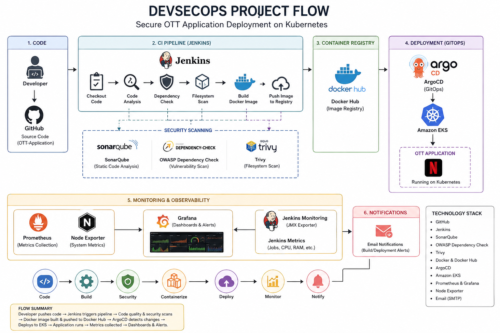
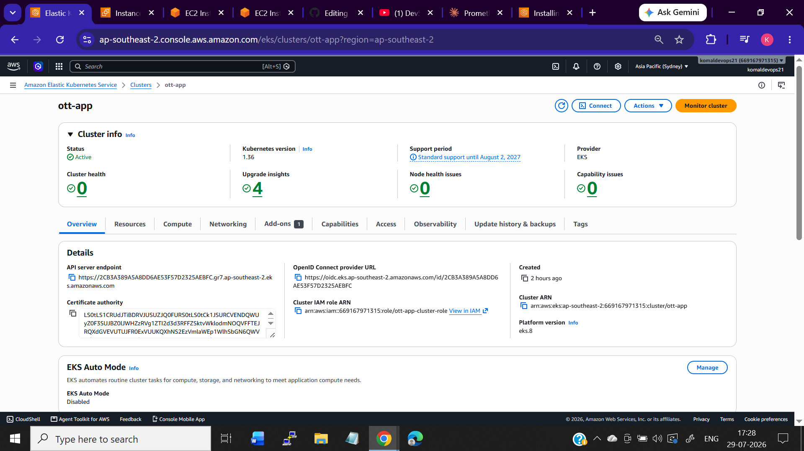
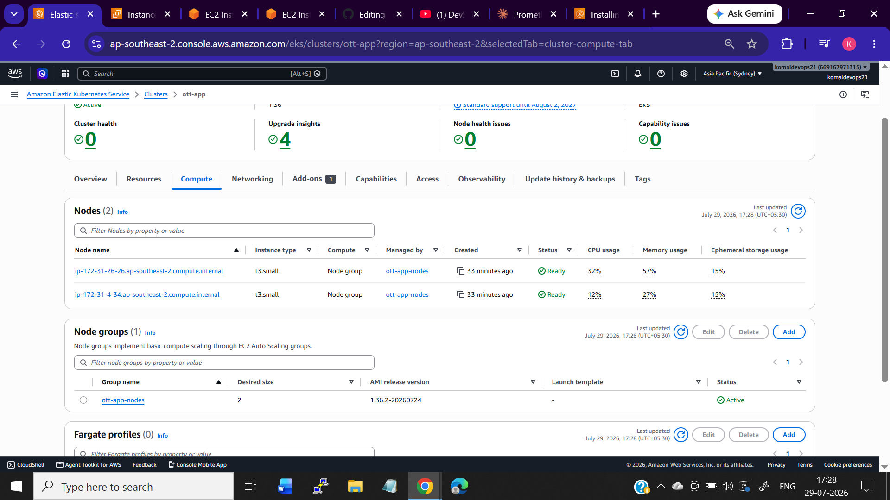
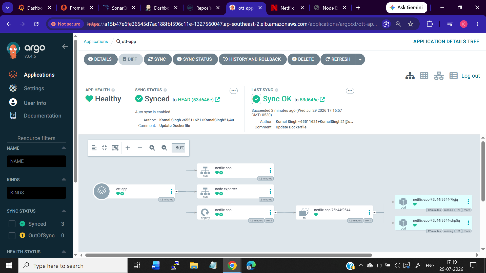
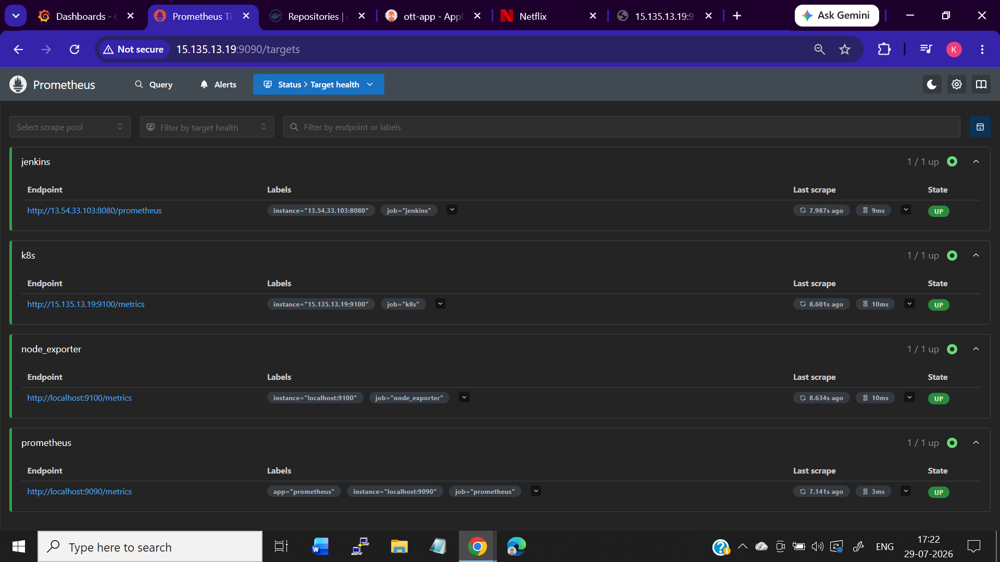
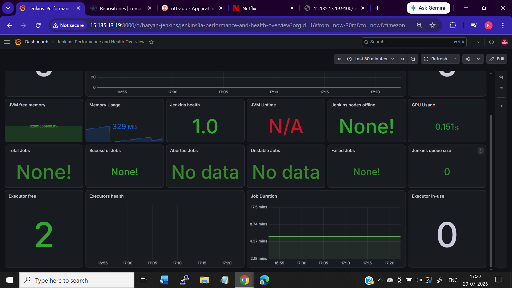
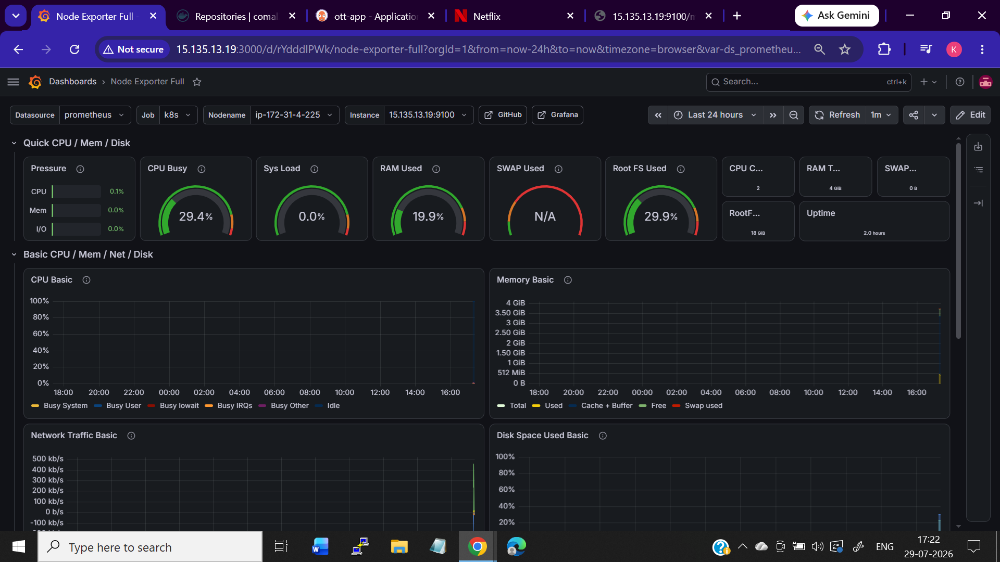
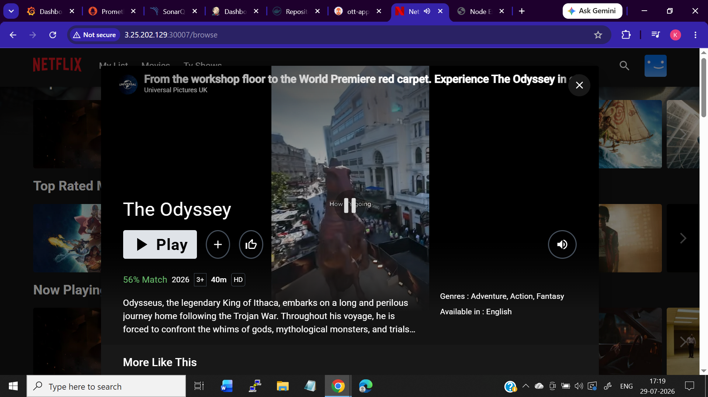
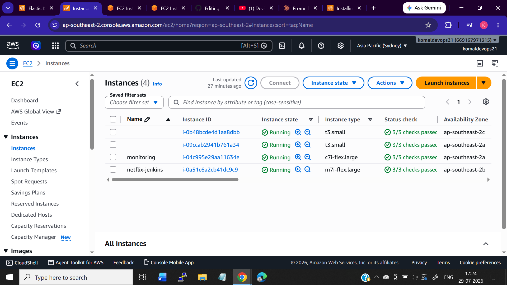
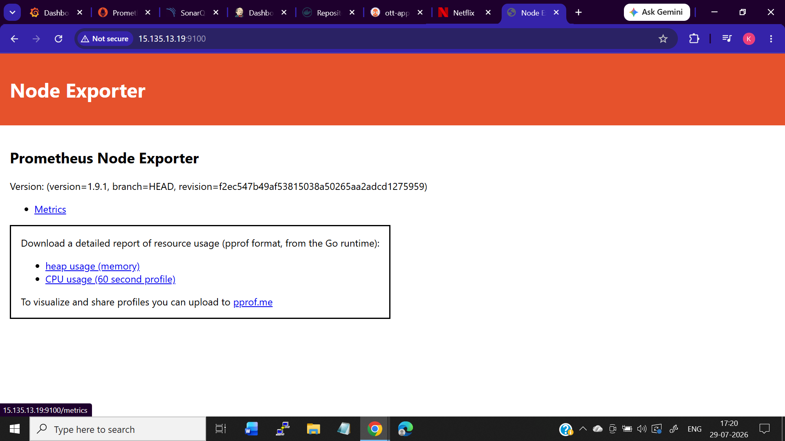

<div align="center">

# 🎬 OTT Application — DevSecOps on AWS

### Secure CI/CD • Docker • Kubernetes • GitOps • Observability

An end-to-end DevSecOps implementation for deploying a containerized OTT
application on AWS using Jenkins, SonarQube, Trivy, Docker, Amazon EKS,
ArgoCD, Prometheus and Grafana.

</div>

---

## 🚀 Project Overview

This project demonstrates the complete application delivery lifecycle:

```text
Developer
   ↓
GitHub
   ↓
Jenkins CI/CD
   ↓
SonarQube + Security Scans
   ↓
Docker Build
   ↓
Docker Hub
   ↓
ArgoCD / GitOps
   ↓
Amazon EKS
   ↓
OTT Application
   ↓
Prometheus + Grafana
```

## 🏗️ Technology Stack

| Technology | Role |
|---|---|
| GitHub | Source control |
| Jenkins | CI/CD automation |
| SonarQube | Code quality & security analysis |
| OWASP Dependency Check | Dependency vulnerability scanning |
| Trivy | Filesystem & container scanning |
| Docker | Containerization |
| Docker Hub | Container registry |
| Amazon EKS | Kubernetes orchestration |
| ArgoCD | GitOps deployment |
| Prometheus | Metrics collection |
| Grafana | Monitoring & visualization |
| Node Exporter | Infrastructure metrics |

## ☁️ AWS Infrastructure

The platform was implemented using AWS Free Tier-friendly resources where
practical.

- EC2-based Jenkins server
- Amazon EKS cluster
- Kubernetes node group
- VPC and security groups
- 20 GB storage


## 🔐 DevSecOps Pipeline

```text
Code
 ↓
SonarQube
 ↓
OWASP Dependency Check
 ↓
Trivy FS Scan
 ↓
Docker Build
 ↓
Trivy Image Scan
 ↓
Docker Hub
 ↓
GitOps Deployment
```

## ☸️ Kubernetes & GitOps

The application runs on Amazon EKS and is managed using ArgoCD.







## 📊 Observability

Prometheus collects infrastructure and platform metrics, while Grafana
provides operational dashboards.







## 🎬 Application

The OTT application is deployed and accessible through Kubernetes.



## 🖥️ Infrastructure





## 🎯 What This Project Demonstrates

- End-to-end DevSecOps implementation
- CI/CD automation with Jenkins
- Secure container image lifecycle
- Kubernetes deployment on Amazon EKS
- GitOps with ArgoCD
- Infrastructure and application observability
- Security scanning integrated into CI/CD
- Real-world troubleshooting across AWS, Docker, Kubernetes and monitoring

## 📚 Documentation

Detailed implementation steps, prerequisites, commands and troubleshooting
are available in the [`docs/`](./docs/) directory.

- [Prerequisites](./docs/pre-requisites.md)
- [Implementation](./docs/implementation.md)

## Future Enhancements

- Terraform
- Helm
- HashiCorp Vault
- Loki
- OpenTelemetry
- Horizontal Pod Autoscaler
- OPA Gatekeeper

---

