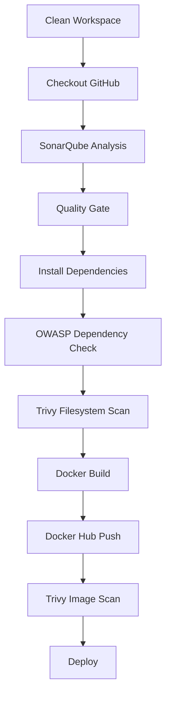
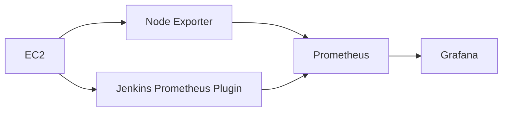
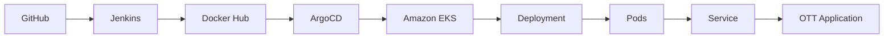
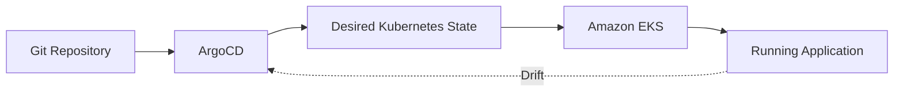

### **Phase 1: Initial Setup and Deployment**

**Step 1: Launch an EC2 Instance:**
| Setting | Value |
|---------|-------|
| AMI | Ubuntu 24.04 LTS |
| Instance Type | **c7i-flex.large** | - A compute-optimized instance that provides sufficient CPU performance for Jenkins builds, Docker, SonarQube, and security scans.
| Storage | 20 GB gp3 |
| Key Pair | New or Existing |
| VPC | 22, 80, 443, 8080 (Jenkins), 9000 (SonarQube), 8081 (Local App) |
- Connect to the instance using SSH.

**Step 2: Clone the Code:**

- Update all the packages:
    ```bash
    sudo apt update && sudo apt upgrade -y
    ```
- Verify Git installation:
    ```bash
    git --version
    ```
- If Git is not installed:
    ```bash
    sudo apt install git -y
    ```
- Clone your application's code repository onto the EC2 instance:
    
    ```bash
    git clone https://github.com/KomalSingh21/OTT-Application.git
    ```

---
**Step 3: Get a TMDB API Key:** 

This application uses **The Movie Database (TMDB) API** to fetch movie and TV show information.

- Visit **https://www.themoviedb.org/**
- Create an account or sign in.
- Go to **Profile → Settings → API**.
- Click **Create** and accept the terms.
- Complete the required details and submit the request.
- Copy your **TMDB API Key (v3 Auth)**.

---    
**Step 4: Install Docker & Run the Application**

- Install Docker:

```bash
sudo apt update
sudo apt install docker.io -y
sudo usermod -aG docker $USER
newgrp docker
sudo chmod 777 /var/run/docker.sock
```

- Build the Docker image:

```bash
docker build --build-arg TMDB_V3_API_KEY=<your-api-key> -t ott .
```
> **Note:** The API key is passed as a **Docker build argument** instead of hardcoding it in the source code.

- Run the container:

```bash
docker run -d --name ott-app -p 8081:80 ott
```

- Access the application:

```text
http://<EC2-PUBLIC-IP>:8081
```

### **Phase 2: Security**

**Step 4: Install SonarQube and Trivy:**
    - Install SonarQube and Trivy on the EC2 instance to scan for vulnerabilities.
        
        Run SonarQube as a Docker container:
        ```
        docker run -d --name sonar -p 9000:9000 sonarqube:lts-community
        ```
        
        Access SonarQube: http://<EC2-PUBLIC-IP>:9000  
        
        Default credentials:
        Username: admin
        Password: admin
        
    - To install Trivy:
        ```
        sudo apt-get update
        sudo apt-get install wget apt-transport-https gnupg lsb-release
        wget -qO - https://aquasecurity.github.io/trivy-repo/deb/public.key | sudo apt-key add -
        echo deb https://aquasecurity.github.io/trivy-repo/deb $(lsb_release -sc) main | sudo tee -a /etc/apt/sources.list.d/trivy.list
        sudo apt-get update
        sudo apt-get install trivy -y     
        ```
       Verify:

        ```bash
        trivy --version
        ```
        
        Filesystem scan:
        
        ```bash
        trivy fs .
        ```
        
        Image scan:
        
        ```bash
        trivy image <image-name>
        ```
      

### **Phase 3: CI/CD Setup**

**Step 1: Install Jenkins for Automation:**
    - Install Jenkins on the EC2 instance to automate deployment:
    Install Java
    
    ```bash
    sudo apt update
    sudo apt install fontconfig openjdk-17-jre
    java -version
    openjdk version "17.0.8" 2023-07-18
    OpenJDK Runtime Environment (build 17.0.8+7-Debian-1deb12u1)
    OpenJDK 64-Bit Server VM (build 17.0.8+7-Debian-1deb12u1, mixed mode, sharing)
    
    #jenkins
    sudo wget -O /usr/share/keyrings/jenkins-keyring.asc \
    https://pkg.jenkins.io/debian-stable/jenkins.io-2023.key
    echo deb [signed-by=/usr/share/keyrings/jenkins-keyring.asc] \
    https://pkg.jenkins.io/debian-stable binary/ | sudo tee \
    /etc/apt/sources.list.d/jenkins.list > /dev/null
    sudo apt-get update
    sudo apt-get install jenkins
    sudo systemctl start jenkins
    sudo systemctl enable jenkins
    ```
    
    - Access Jenkins in a web browser using the public IP of your EC2 instance.
        
       ```text
http://<EC2-PUBLIC-IP>:8080
```

Initial password:

```bash
sudo cat /var/lib/jenkins/secrets/initialAdminPassword
```

        
**Step 2: Install Necessary Plugins in Jenkins:**

Go to Manage Jenkins →Plugins → Available Plugins →

Install below plugins
- Eclipse Temurin Installer
- SonarQube Scanner
- NodeJS Plugin
- Email Extension Plugin
- OWASP Dependency-Check
- Docker
- Docker Commons
- Docker Pipeline
- Docker API
- Docker Build Step
- Prometheus metrics plugin

**Step 3: Configure Java and Nodejs in Global Tool Configuration**

Go to Manage Jenkins → Tools 
Configure automatic installations for:

```text
jdk21
nodejs20
sonar-scanner
DP-Check
docker
```
> The tool names must exactly match the names referenced in the Jenkinsfile.
---
Click on Apply and Save

**Step 4: Create SonarQube Credentials**

Create a SonarQube token and store it in:

**Manage Jenkins → Credentials → Global credentials → Add Credentials**

Use:

```text
Kind: Secret text
ID: sonar-token
Secret: <SONARQUBE-TOKEN>
```

Configure the server under **Manage Jenkins → System**:

```text
Name: sonar-server
URL: http://<SONARQUBE-IP>:9000
```

Configure the SonarQube Scanner under **Manage Jenkins → Tools**.

---
** Step 5: SonarQube Webhook**

Configure a SonarQube webhook pointing to:

```text
http://<JENKINS-IP>:8080/sonarqube-webhook/
```

This allows Jenkins' `waitForQualityGate` step to receive the completed analysis result.

---
**Add DockerHub Credentials:**

- To securely handle DockerHub credentials in your Jenkins pipeline, follow these steps:
  - Go to "Dashboard" → "Manage Jenkins" → "Manage Credentials."
  - Click on "System" and then "Global credentials (unrestricted)."
  - Click on "Add Credentials" on the left side.
  - Choose "Secret text" as the kind of credentials.
  - Enter your DockerHub credentials (Username and Password) and give the credentials an ID (e.g., "docker").
  - Click "OK" to save your DockerHub credentials.
---

### **Phase 4 — Complete DevSecOps Pipeline**



**Step 1. Configure CI/CD Pipeline in Jenkins:**
- Create a CI/CD pipeline in Jenkins to automate your application deployment.

```groovy

pipeline {
    agent any

    tools {
        jdk 'jdk21'
        nodejs 'nodejs20'
    }

    environment {
        SCANNER_HOME = tool 'sonar-scanner'
    }

    stages {
        stage('Clean Workspace') {
            steps { cleanWs() }
        }

        stage('Checkout from Git') {
            steps {
                git branch: 'main',
                    url: 'https://github.com/KomalSingh21/DevSecOps-OTT-Platform.git'
            }
        }

        stage('SonarQube Analysis') {
            steps {
                withSonarQubeEnv('sonar-server') {
                    sh '''
                        $SCANNER_HOME/bin/sonar-scanner \\
                        -Dsonar.projectName=ott \\
                        -Dsonar.projectKey=ott
                    '''
                }
            }
        }

        stage('Quality Gate') {
            steps {
                script {
                    waitForQualityGate(
                        abortPipeline: true,
                        credentialsId: 'sonar-token'
                    )
                }
            }
        }

        stage('Install Dependencies') {
            steps { sh 'npm install' }
        }

        stage('OWASP FS Scan') {
            steps {
                dependencyCheck(
                    additionalArguments: '--scan ./ --disableYarnAudit --disableNodeAudit',
                    odcInstallation: 'DP-Check'
                )
                dependencyCheckPublisher(
                    pattern: '**/dependency-check-report.xml'
                )
            }
        }

        stage('Trivy FS Scan') {
            steps { sh 'trivy fs . > trivyfs.txt' }
        }

        stage('Docker Build & Push') {
            steps {
                script {
                    withDockerRegistry(
                        credentialsId: 'docker',
                        toolName: 'docker'
                    ) {
                        withCredentials([
                            string(
                                credentialsId: 'tmdb-api-key',
                                variable: 'TMDB_V3_API_KEY'
                            )
                        ]) {
                            sh '''
                                docker build \\
                                --build-arg TMDB_V3_API_KEY="$TMDB_V3_API_KEY" \\
                                -t ott .
                            '''

                            sh 'docker tag ott <DOCKERHUB-USERNAME>/ott:latest'
                            sh 'docker push <DOCKERHUB-USERNAME>/ott:latest'
                        }
                    }
                }
            }
        }

        stage('Trivy Image Scan') {
            steps {
                sh 'trivy image <DOCKERHUB-USERNAME>/ott:latest > trivyimage.txt'
            }
        }

        stage('Deploy to Container') {
            steps {
                sh 'docker run -d --name ott -p 8081:80 <DOCKERHUB-USERNAME>/ott:latest'
            }
        }
    }
}
        stage('Deploy to kubernetes'){
            steps{
                script{
                    dir('Kubernetes') {
                        withKubeConfig(caCertificate: '', clusterName: '', contextName: '', credentialsId: 'k8s', namespace: '', restrictKubeConfigAccess: false, serverUrl: '') {
                                sh 'kubectl apply -f deployment.yml'
                                sh 'kubectl apply -f service.yml'
                        }   
                    }
                }
       

    
    post {
     always {
        emailext attachLog: true,
            subject: "'${currentBuild.result}'",
            body: "Project: ${env.JOB_NAME}<br/>" +
                "Build Number: ${env.BUILD_NUMBER}<br/>" +
                "URL: ${env.BUILD_URL}<br/>",
            to: 'comalsingh12@gmail.com',                                #change mail here
            attachmentsPattern: 'trivyfs.txt,trivyimage.txt'
        }
    }
}
}

```
> **Security improvement:** The TMDB key is stored in Jenkins Credentials (`tmdb-api-key`) and injected only during the build. Docker Hub credentials are also stored in Jenkins Credentials.

---
🛠️ Jenkins + Docker Troubleshooting

A real pipeline failure encountered during implementation was:

```text
permission denied while trying to connect to the Docker daemon socket
```

Fix:

```bash
sudo usermod -aG docker jenkins
sudo systemctl restart jenkins
```

This gives the Jenkins service account access to the Docker daemon.

---

### **Phase 5: Monitoring**



1. **Install Prometheus and Grafana:**

   Set up Prometheus and Grafana to monitor your application.

   **Installing Prometheus:**

   First, create a dedicated Linux user for Prometheus and download Prometheus:

   ```bash
   sudo useradd --system --no-create-home --shell /bin/false prometheus
   wget https://github.com/prometheus/prometheus/releases/download/v2.47.1/prometheus-2.47.1.linux-amd64.tar.gz
   ```

   Extract Prometheus files, move them, and create directories:

   ```bash
   tar -xvf prometheus-2.47.1.linux-amd64.tar.gz
   cd prometheus-2.47.1.linux-amd64/
   sudo mkdir -p /data /etc/prometheus
   sudo mv prometheus promtool /usr/local/bin/
   sudo mv consoles/ console_libraries/ /etc/prometheus/
   sudo mv prometheus.yml /etc/prometheus/prometheus.yml
   ```

   Set ownership for directories:

   ```bash
   sudo chown -R prometheus:prometheus /etc/prometheus/ /data/
   ```

   Create a systemd unit configuration file for Prometheus:

   ```bash
   sudo nano /etc/systemd/system/prometheus.service
   ```

   Add the following content to the `prometheus.service` file:

   ```plaintext
   [Unit]
   Description=Prometheus
   Wants=network-online.target
   After=network-online.target

   StartLimitIntervalSec=500
   StartLimitBurst=5

   [Service]
   User=prometheus
   Group=prometheus
   Type=simple
   Restart=on-failure
   RestartSec=5s
   ExecStart=/usr/local/bin/prometheus \
     --config.file=/etc/prometheus/prometheus.yml \
     --storage.tsdb.path=/data \
     --web.console.templates=/etc/prometheus/consoles \
     --web.console.libraries=/etc/prometheus/console_libraries \
     --web.listen-address=0.0.0.0:9090 \
     --web.enable-lifecycle

   [Install]
   WantedBy=multi-user.target
   ```

   Here's a brief explanation of the key parts in this `prometheus.service` file:

   - `User` and `Group` specify the Linux user and group under which Prometheus will run.

   - `ExecStart` is where you specify the Prometheus binary path, the location of the configuration file (`prometheus.yml`), the storage directory, and other settings.

   - `web.listen-address` configures Prometheus to listen on all network interfaces on port 9090.

   - `web.enable-lifecycle` allows for management of Prometheus through API calls.

   Enable and start Prometheus:

   ```bash
   sudo systemctl enable prometheus
   sudo systemctl start prometheus
   ```

   Verify Prometheus's status:

   ```bash
   sudo systemctl status prometheus
   ```

   You can access Prometheus in a web browser using your server's IP and port 9090:

   `http://<your-server-ip>:9090`

   **Installing Node Exporter:**

   Create a system user for Node Exporter and download Node Exporter:

   ```bash
   sudo useradd --system --no-create-home --shell /bin/false node_exporter
   wget https://github.com/prometheus/node_exporter/releases/download/v1.6.1/node_exporter-1.6.1.linux-amd64.tar.gz
   ```

   Extract Node Exporter files, move the binary, and clean up:

   ```bash
   tar -xvf node_exporter-1.6.1.linux-amd64.tar.gz
   sudo mv node_exporter-1.6.1.linux-amd64/node_exporter /usr/local/bin/
   rm -rf node_exporter*
   ```

   Create a systemd unit configuration file for Node Exporter:

   ```bash
   sudo nano /etc/systemd/system/node_exporter.service
   ```

   Add the following content to the `node_exporter.service` file:

   ```plaintext
   [Unit]
   Description=Node Exporter
   Wants=network-online.target
   After=network-online.target

   StartLimitIntervalSec=500
   StartLimitBurst=5

   [Service]
   User=node_exporter
   Group=node_exporter
   Type=simple
   Restart=on-failure
   RestartSec=5s
   ExecStart=/usr/local/bin/node_exporter --collector.logind

   [Install]
   WantedBy=multi-user.target
   ```

   Replace `--collector.logind` with any additional flags as needed.

   Enable and start Node Exporter:

   ```bash
   sudo systemctl enable node_exporter
   sudo systemctl start node_exporter
   ```

   Verify the Node Exporter's status:

   ```bash
   sudo systemctl status node_exporter
   ```

   You can access Node Exporter metrics in Prometheus.

2. **Configure Prometheus Plugin Integration:**

   Integrate Jenkins with Prometheus to monitor the CI/CD pipeline.

   **Prometheus Configuration:**

   To configure Prometheus to scrape metrics from Node Exporter and Jenkins, you need to modify the `prometheus.yml` file. Here is an example `prometheus.yml` configuration for your setup:

   ```yaml
   global:
     scrape_interval: 15s

   scrape_configs:
     - job_name: 'node_exporter'
       static_configs:
         - targets: ['localhost:9100']

     - job_name: 'jenkins'
       metrics_path: '/prometheus'
       static_configs:
         - targets: ['<your-jenkins-ip>:<your-jenkins-port>']
   ```

   Make sure to replace `<your-jenkins-ip>` and `<your-jenkins-port>` with the appropriate values for your Jenkins setup.

   Check the validity of the configuration file:

   ```bash
   promtool check config /etc/prometheus/prometheus.yml
   ```

   Reload the Prometheus configuration without restarting:

   ```bash
   curl -X POST http://localhost:9090/-/reload
   ```

   You can access Prometheus targets at:

   `http://<your-prometheus-ip>:9090/targets`


### Grafana

**Install Grafana on Ubuntu 24.04 and Set it up to Work with Prometheus**

**Step 1: Install Dependencies:**

First, ensure that all necessary dependencies are installed:

```bash
sudo apt-get update
sudo apt-get install -y apt-transport-https software-properties-common
```

**Step 2: Add the GPG Key:**

Add the GPG key for Grafana:

```bash
wget -q -O - https://packages.grafana.com/gpg.key | sudo apt-key add -
```

**Step 3: Add Grafana Repository:**

Add the repository for Grafana stable releases:

```bash
echo "deb https://packages.grafana.com/oss/deb stable main" | sudo tee -a /etc/apt/sources.list.d/grafana.list
```

**Step 4: Update and Install Grafana:**

Update the package list and install Grafana:

```bash
sudo apt-get update
sudo apt-get -y install grafana
```

**Step 5: Enable and Start Grafana Service:**

To automatically start Grafana after a reboot, enable the service:

```bash
sudo systemctl enable grafana-server
```

Then, start Grafana:

```bash
sudo systemctl start grafana-server
```

**Step 6: Check Grafana Status:**

Verify the status of the Grafana service to ensure it's running correctly:

```bash
sudo systemctl status grafana-server
```

**Step 7: Access Grafana Web Interface:**

Open a web browser and navigate to Grafana using your server's IP address. The default port for Grafana is 3000. For example:

`http://<your-server-ip>:3000`

You'll be prompted to log in to Grafana. The default username is "admin," and the default password is also "admin."

**Step 8: Change the Default Password:**

When you log in for the first time, Grafana will prompt you to change the default password for security reasons. Follow the prompts to set a new password.

**Step 9: Add Prometheus Data Source:**

To visualize metrics, you need to add a data source. Follow these steps:

- Click on the gear icon (⚙️) in the left sidebar to open the "Configuration" menu.

- Select "Data Sources."

- Click on the "Add data source" button.

- Choose "Prometheus" as the data source type.

- In the "HTTP" section:
  - Set the "URL" to `http://localhost:9090` (assuming Prometheus is running on the same server).
  - Click the "Save & Test" button to ensure the data source is working.

**Step 10: Import a Dashboard:**

To make it easier to view metrics, you can import a pre-configured dashboard. Follow these steps:

- Click on the "+" (plus) icon in the left sidebar to open the "Create" menu.

- Select "Dashboard."

- Click on the "Import" dashboard option.

- Enter the dashboard code you want to import (e.g., code 1860 - Node Exporter,9964 - Jenkins).

- Click the "Load" button.

- Select the data source you added (Prometheus) from the dropdown.

- Click on the "Import" button.

You should now have a Grafana dashboard set up to visualize metrics from Prometheus.

Grafana is a powerful tool for creating visualizations and dashboards, and you can further customize it to suit your specific monitoring needs.

That's it! You've successfully installed and set up Grafana to work with Prometheus for monitoring and visualization.

2. **Configure Prometheus Plugin Integration:**
    - Integrate Jenkins with Prometheus to monitor the CI/CD pipeline.

3. **Jenkins Email Notifications**

The implementation used Gmail SMTP and a Google App Password.

1. Enable 2FA on the Gmail account.
2. Create an App Password.
3. Store it in Jenkins Credentials.
4. Configure Jenkins SMTP.

Example:

```text
SMTP server: smtp.gmail.com
Port: 465
Security: SSL
Username: <EMAIL>
Password: <JENKINS-CREDENTIAL>
```

Use Jenkins' test configuration to verify delivery.

> Do not store an email password or App Password directly in the Jenkinsfile.

---
# Phase 6: Kubernetes and Amazon EKS

The Kubernetes phase moves the application from a single Docker host to an orchestrated environment.



## Create Kubernetes Cluster with Nodegroups

Create an Amazon EKS cluster with node groups.

The cluster provides the Kubernetes environment required for the application deployment.

> **Cost warning:** EKS can incur charges. Delete the cluster and associated resources when the lab is complete.

## Install kubectl & Helm

```bash
curl -LO "https://dl.k8s.io/release/$(curl -L -s https://dl.k8s.io/release/stable.txt)/bin/linux/amd64/kubectl"
chmod +x kubectl
sudo mv kubectl /usr/local/bin/

kubectl version --client
```

```bash
curl https://raw.githubusercontent.com/helm/helm/main/scripts/get-helm-3 | bash
helm version
```

## Create EKS Cluster

Create an EKS cluster using the AWS Console or CLI.

Example structure:

```text
Cluster: ott-app
Node Group: ott-app-nodes
AMI: Amazon Linux 2023
Capacity: On-Demand
Desired Nodes: 2
Minimum: 1
Maximum: 2
Disk: 20 GB
```

Connect:

```bash
aws eks update-kubeconfig --region <region> --name ott-app
kubectl get nodes
```

---
Verify access:

```bash
kubectl get nodes
```
---

## Monitor Kubernetes with Prometheus

Prometheus is a powerful monitoring and alerting toolkit, and you'll use it to monitor your Kubernetes cluster. Additionally, you'll install the node exporter using Helm to collect metrics from your cluster nodes.

### Install Node Exporter using Helm

To begin monitoring your Kubernetes cluster, you'll install the Prometheus Node Exporter. This component allows you to collect system-level metrics from your cluster nodes. Here are the steps to install the Node Exporter using Helm:

1. Add the Prometheus Community Helm repository:

    ```bash
    helm repo add prometheus-community https://prometheus-community.github.io/helm-charts
    ```

2. Create a Kubernetes namespace for the Node Exporter:

    ```bash
    kubectl create namespace prometheus-node-exporter
    ```

3. Install the Node Exporter using Helm:

    ```bash
    helm install prometheus-node-exporter prometheus-community/prometheus-node-exporter --namespace prometheus-node-exporter
    ```

Add a Job to Scrape Metrics on nodeip:9001/metrics in prometheus.yml:

Update your Prometheus configuration (prometheus.yml) to add a new job for scraping metrics from nodeip:9001/metrics. You can do this by adding the following configuration to your prometheus.yml file:


```
  - job_name: 'Netflix'
    metrics_path: '/metrics'
    static_configs:
      - targets: ['node1Ip:9100']
```

Replace 'your-job-name' with a descriptive name for your job. The static_configs section specifies the targets to scrape metrics from, and in this case, it's set to nodeip:9001.

Validate and reload:

```bash
promtool check config /etc/prometheus/prometheus.yml
curl -X POST http://localhost:9090/-/reload
```

### Deploy Application with ArgoCD


1. **Install ArgoCD:**

        ```bash
        kubectl create namespace argocd

        kubectl apply -n argocd -f https://raw.githubusercontent.com/argoproj/argo-cd/stable/manifests/install.yaml
        ```

        Verify:

        ```bash
        kubectl get pods -n argocd
        ```

        Install CLI:

        ```bash
        curl -sSL -o argocd-linux-amd64 https://github.com/argoproj/argo-cd/releases/latest/download/argocd-linux-amd64

        sudo install -m 555 argocd-linux-amd64 /usr/local/bin/argocd
        rm argocd-linux-amd64

        argocd version --client
        ```

        Expose ArgoCD:

        ```bash
        kubectl patch svc argocd-server -n argocd -p '{"spec": {"type": "LoadBalancer"}}'

        kubectl get svc argocd-server -n argocd
        ```

        Get admin password:

        ```bash
        kubectl -n argocd get secret argocd-initial-admin-secret -o jsonpath="{.data.password}" | base64 -d

        echo
        ```


2. **Set Your GitHub Repository as a Source:**

   After installing ArgoCD, you need to set up your GitHub repository as a source for your application deployment. This typically involves configuring the connection to your repository and defining the source for your ArgoCD application. The specific steps will depend on your setup and requirements.

3. **Create an ArgoCD Application:**
   - `name`: Set the name for your application.
   - `destination`: Define the destination where your application should be deployed.
   - `project`: Specify the project the application belongs to.
   - `source`: Set the source of your application, including the GitHub repository URL, revision, and the path to the application within the repository.
   - `syncPolicy`: Configure the sync policy, including automatic syncing, pruning, and self-healing.

  ## The ArgoCD Application was configured through the ArgoCD UI.

The application is configured to:

- Monitor the GitHub repository
- Track the `main` branch
- Use the `Kubernetes/` directory as the manifest source
- Deploy to the Amazon EKS cluster
- Automatically synchronize changes from Git

4. **Access your Application**
   - To Access the app make sure port 30007 is open in your security group and then open a new tab paste your NodeIP:30007, your app should be running.
  
# 🧪 End-to-End Validation Checklist

| Component | Validation |
|---|---|
| EC2 | Instance running and reachable by SSH |
| GitHub | Repository cloned / pipeline checkout succeeds |
| Docker | `docker ps` works |
| OTT app | `:8081` serves the application |
| SonarQube | Analysis and Quality Gate available |
| Trivy | Filesystem and image reports generated |
| Jenkins | Pipeline completes successfully |
| Docker Hub | Image is pushed successfully |
| Prometheus | Targets show `UP` |
| Grafana | Prometheus data source passes test |
| EKS | Nodes are ready |
| ArgoCD | Application is Synced and Healthy |

---

**Phase 7: Cleanup**

Cleanup

Remove Kubernetes resources first:

```bash
kubectl delete application ott-app -n argocd
kubectl delete namespace argocd

helm uninstall prometheus-node-exporter -n prometheus-node-exporter

kubectl delete namespace prometheus-node-exporter
```

Delete EKS:

```bash
aws eks delete-nodegroup --cluster-name ott-app --nodegroup-name ott-app-nodes --region <region>

aws eks delete-cluster --name ott-app --region <region>
```

Terminate EC2 instances and review:

```text
Elastic IPs
EBS volumes
Load balancers
Security groups
IAM roles
Docker containers
Docker images
```

> 💰 EKS control-plane and load-balancer resources can continue generating charges until deleted.

---
